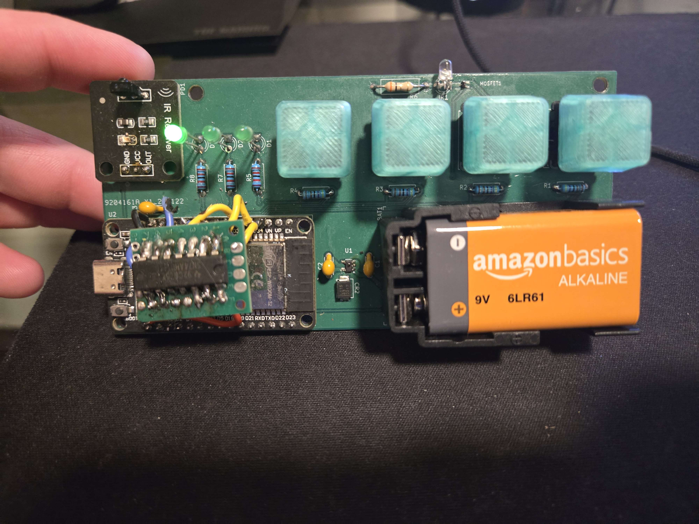
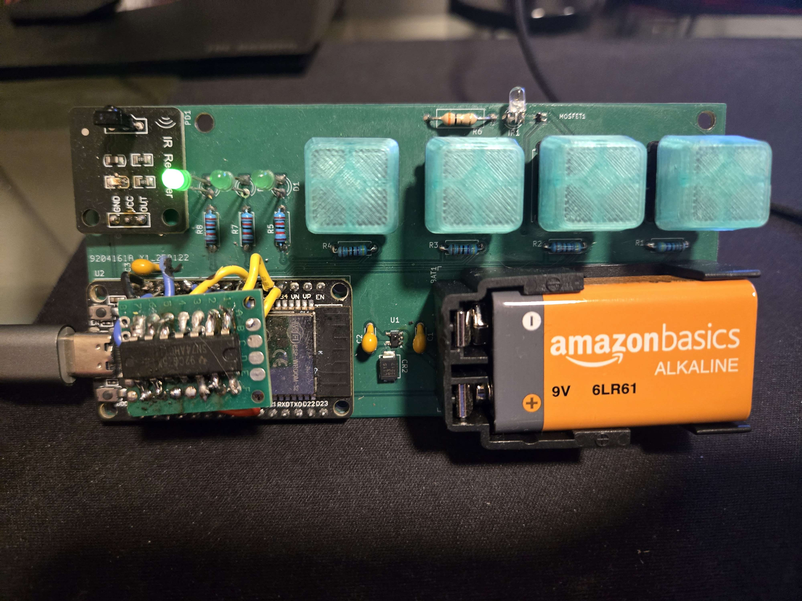
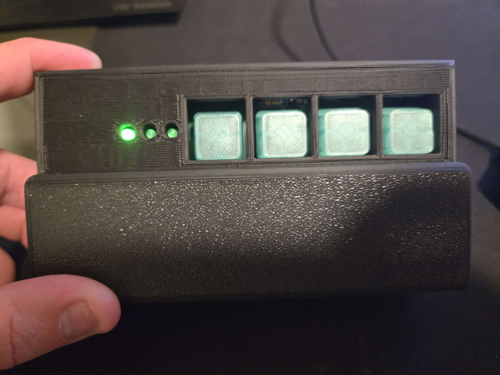
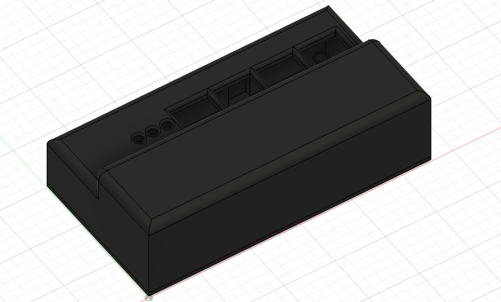

# TV-Remote for Sharp TV

This project is a TV remote designed to work for a Sharp branded TV using Sharp's TV protocol. See https://www.sbprojects.net/knowledge/ir/sharp.php.

This project is purely a personal project and was primarily developed to further my skills in electrical and mechanical engineering. 

All of the code, hardware, and mechanicals were done from scratch by me.

Hardware was done in KiCAD, software using the ESP-IDF platform, and mechanicals in Fusion360.

Due to this being a personal project, the code is not thoroughly documented and there are some rough edges that are not indicative of how I work on projects with more people involved.

The software should be fairly easy to follow by starting in `main.cpp`.

The schematic and PCB layout can be found in the `readme_assets` folder.

## Main hardware components
- An ESP32 WROOM32 DevKit
- An IR sensor
- An IR led + MOSFET for switching
- 4 mechanical switches
- 3 LEDs
- A 9V battery holder

## Main functionality
The 4 keys are split up to have 3 keys which trigger TV code transmission and 1 key to switch what TV codes the other 3 keys map to.

The LEDs indicate which set of codes the keys are set to trigger. There are 3 LEDs allowing for 3 mappings in the current software (could do binary to expand this, i.e. off off on = first set, off on off = second set, off on on = third set).

For instance, the board boots up with the left most LED turned on. This indicates we have the first set of codes enabled. That could map keys 1-3 like this for instance:

| Key 1  | Key 2  | Key 3  |
|--------|--------|--------|
| 0x00FE | 0x00AB | 0xE3AB |

Pushing the 4th key would change the mapping to the second set of codes:

| Key 1  | Key 2  | Key 3  |
|--------|--------|--------|
| 0x00EE | 0x00BA | 0xFEFE |

## Where do the codes come from?
In order to figure out what codes to use, I simply read the codes coming off of the real remote using the IR sensor. I couldn't find these codes documented anywhere online.

## Software
The software is fairly simple. It consists of:
- Input handling for the buttons
- Some simple GPIO driven LED output 
- IR transmission using a PWM to do the modulation for IR encoding 
- IR reading to get codes off of the original remote
- Sleep handling

## Main learning points for next time
- Part of what was necessary to make this project truly "successful" was for it to survive a long time without draining the battery. I set the MCU to go into deep sleep properly, but something about my hardware is still draining way too much power. This is something I need to come back to and figure out.
- When I first did my hardware design, I didn't think too hard about sleep and waking up from sleep. This was a pretty large oversight and ended up requiring me to insert a logic inverter (the hackily soldered IC above the MCU). This would have been much nicer if it were part of the PCB, but I didn't want to order new PCBs. This addition is not updated in the schematic.